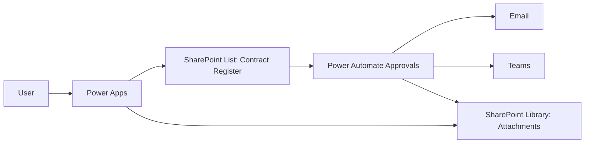
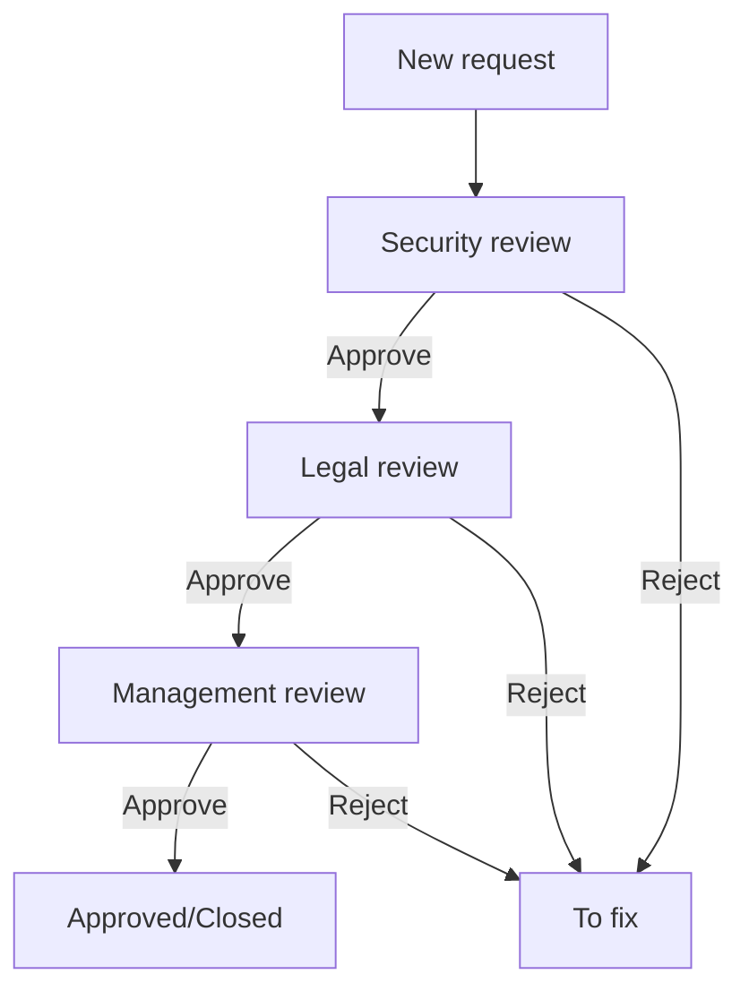

# Legal Contract Register

A Power Platform solution for **registering contracts** and running a **multi-step verification workflow** (Security → Legal → Management / optional Logistics). The goal is to standardize contract intake, validate required data + attachments, control access to files, and automate notifications and approvals.

## Current progress

| Milestone          | Status         | Notes                   |
| ------------------ | -------------- | ----------------------- |
| M1: SharePoint     | ✅ Done        | list + library + views  |
| M2: Power Apps MVP | ⏳ In progress | validations + Patch     |
| M3: Upload flow    | ⏳ In progress | PowerApps V2 trigger    |
| M4: Approvals      | Planned        | Security → Legal → Mgmt |
| M5: Permissions    | Planned        | grant/revoke per stage  |
| M6: Notifications  | Planned        | email + Teams           |
| M7: Hardening      | Planned        | logs + retries          |
| M8: PROD           | Planned        | runbook + tests         |

---

## Scope (high-level)

- Central **contract register** (metadata + status tracking)
- Separate **attachments library** (contract files + other documents)
- **Automated approvals** via Power Automate
- **Notifications** via Email / Teams
- **Permission control** per stage (lock/unlock editing)
- **PL/EN UI**

---

## Plan of action (to-do checklist)

### 1) Define the process and roles

- [ ] Confirm final approval order: **Security → Legal → Management** (optional Logistics)
- [ ] Define who approves each stage (users/groups)
- [ ] Define status lifecycle (New / In review / To fix / Rejected / Approved / Closed)
- [ ] Define SLA rules (reminders/escalations)
- [ ] Define required attachments (Contract, ATC Request) and naming conventions

---

### 2) SharePoint setup

#### 2.1 Create the Contract Register list

- [x] Create SharePoint list: **contract_register**
- [x] Add columns for:
  - [x] Contract ID (unique)
  - [x] Contract title + description
  - [x] Contractor name, optional NIP/KRS
  - [x] Dates (concluding/start/end)
  - [x] Team + contact person (Person field)
  - [x] Procurement type
  - [x] Personal data processing
  - [x] ATC + Legal review + Realisation status
  - [x] Rejection reason + audit fields (optional)
- [x] Create views:
  - [x] New / In Security / In Legal / In Management
  - [x] To fix
  - [x] Approved / Closed
  - [x] Overdue (based on date logic)
        Lock down SharePoint UI (recommended):
  - [ ] Restrict permissions so users **cannot create/edit items directly in SharePoint** (use Power Apps only)
  - [ ] Hide/disable **"New"** button for end users where possible (modern list experience limitations apply)
  - [ ] Disable **Quick Edit / Grid view** for end users (prevent bypassing validations)
  - [ ] Ensure status fields are updated **only by flows** (users read-only)
  - [ ] Use Power Apps form as the only entry point (custom form for the list)

#### 2.2 Create Attachments library

- [x] Create SharePoint document library: **contract_attachments**
- [x] Folder strategy: `/ContractId/` per contract
- [x] Decide if metadata columns are needed:
  - [x] ContractId
  - [ ] AttachmentType (Contract / ATC / Other)
  - [ ] Stage (Submitted / Security / Legal / Management / Fix)
- [x] Enable versioning
- [ ] Confirm default permissions (least privilege)

---

### 3) Power Apps (Canvas App) – UI + validations

#### 3.1 Build the intake form

- [ ] Create screens:
  - [ ] New request (create)
  - [ ] Request details (read-only per stage)
  - [ ] Fix request (edit when status = To fix)
- [ ] Implement required fields validation
- [ ] Implement date rules:
  - [ ] No past date (if required by process)
  - [ ] End date cannot be before start date
- [ ] Implement attachment validation:
  - [ ] Contract: only `.doc/.docx`
  - [ ] ATC: file name format `ATC REQUEST_<Vendor>.docx` (or `.doc`)
- [ ] Implement clean UX:
  - [ ] Disable submit button when inputs invalid
  - [ ] Clear/reset form after successful submission
  - [ ] Show success/warning/error notifications

#### 3.2 Data write pattern

- [ ] Patch metadata into SharePoint list
- [ ] Store patched record in a global variable (e.g. `gblNewRecord`)
- [ ] Upload attachments to library via Power Automate (or SharePoint connector)
- [ ] Navigate to confirmation/details screen

#### 3.3 Bilingual UI (PL/EN)

- [ ] Create a static translations dictionary in-app
- [ ] Implement language toggle button
- [ ] Use translation keys for labels and notifications

---

### 4) Power Automate – flows (workflow engine)

#### 4.1 Attachment upload flow

- [ ] Create flow: `UPLOAD_ATTACHMENT`
- [ ] Trigger: PowerApps (V2)
- [ ] Inputs:
  - [ ] ContractId (text)
  - [ ] File payload (name + contentBytes)
- [ ] Actions:
  - [ ] Create folder `/ContractId/` if missing
  - [ ] Upload file
  - [ ] Set metadata (optional)
  - [ ] Return file link (optional)

#### 4.2 Security approval flow (ATC)

- [ ] Create flow: `APPROVAL_SECURITY`
- [ ] Trigger: list item created or status = New
- [ ] Actions:
  - [ ] Set status = Security review
  - [ ] Start approval (Security group)
  - [ ] On approve → set status = Legal review
  - [ ] On reject → set status = To fix + write rejection reason + notify requester

#### 4.3 Legal approval flow

- [ ] Create flow: `APPROVAL_LEGAL`
- [ ] Trigger: status = Legal review
- [ ] Actions:
  - [ ] Start approval (Legal group)
  - [ ] On approve → set status = Management review
  - [ ] On reject → set status = To fix + reason + notify requester

#### 4.4 Management approval flow

- [ ] Create flow: `APPROVAL_MANAGEMENT`
- [ ] Trigger: status = Management review
- [ ] Actions:
  - [ ] (Optional) convert Word → PDF
  - [ ] Start approval (Management)
  - [ ] On approve → set status = Approved/Closed + notify parties
  - [ ] On reject → set status = To fix + reason + notify requester

#### 4.5 Optional flows

- [ ] Reminder: if not signed within X days after Legal approval
- [ ] ATC re-check reminders (scheduled)
- [ ] Vendor registry sync (build contractor library)

---

### 5) Notifications (Email / Teams)

- [ ] Define templates per stage (short + with links)
- [ ] Email recipients:
  - [ ] Requester
  - [ ] Approvers at each stage
  - [ ] Optional: assistants / shared mailboxes
- [ ] Teams notifications:
  - [ ] Post to channel per stage or only for escalation
  - [ ] Include ContractId + status + link to item + link to folder

---

### 6) Permission model (attachments)

- [ ] Decide access rules per stage:
  - [ ] Requester can upload/edit only during submission and To fix
  - [ ] During review stages, requester loses edit permissions
  - [ ] Approver group for current stage has edit
  - [ ] Others have read (or no access)
- [ ] Implement in flows:
  - [ ] Break inheritance on `/ContractId/` folder
  - [ ] Grant/Revoke permissions per stage transition
  - [ ] Restore requester edit on rejection

---

### 7) Testing plan

- [ ] Happy path: submit → Security approve → Legal approve → Mgmt approve → close
- [ ] Reject in Security / Legal / Mgmt → To fix → resubmit
- [ ] Invalid attachments:
  - [ ] wrong extension
  - [ ] wrong ATC naming
- [ ] Edge cases:
  - [ ] missing folder
  - [ ] permission actions fail
  - [ ] multiple uploads / re-uploads
  - [ ] user without required permissions

---

## Diagrams

### Architecture (draft)

### Workflow (draft)

## Assumptions / Constraints

- [ ] Users submit requests **only via Power Apps** (SharePoint UI restricted)
- [ ] Attachments are stored in SharePoint library and linked by **ContractId**
- [ ] Status changes are performed **only by Power Automate flows**
- [ ] Approvals are handled through Microsoft 365 Approvals / email links
- [ ] The solution targets a single tenant and a single SharePoint site (initially)

## Permissions matrix (draft)

| Stage / Status    | Requester     | Security | Legal | Management  | Service account |
| ----------------- | ------------- | -------- | ----- | ----------- | --------------- |
| New (submission)  | Edit + upload | Read     | Read  | Read        | Full            |
| Security review   | Read          | Edit     | Read  | Read        | Full            |
| Legal review      | Read          | Read     | Edit  | Read        | Full            |
| Management review | Read          | Read     | Read  | Edit/Read\* | Full            |
| To fix            | Edit + upload | Read     | Read  | Read        | Full            |
| Approved/Closed   | Read          | Read     | Read  | Read        | Full            |

\* depends on whether Management uploads signed copies.

## Observability / audit

- [ ] Track approvals in list columns:
  - [ ] ApprovedBy / ApprovedAt (per stage)
  - [ ] RejectionReason + RejectedBy
- [ ] Keep SharePoint version history enabled
- [ ] Add an “Admin view” to list all stuck items by stage
- [ ] Optional: log flow failures to a separate SharePoint list `flow_errors`

## Security considerations

- [ ] No sensitive tenant data in repo (URLs, IDs, emails)
- [ ] Principle of least privilege for SharePoint and flows
- [ ] Separate attachments library to control access independently from register
- [ ] Prevent bypassing Power Apps validation (restrict SharePoint UI)

## Roadmap (ideas)

- [ ] Word → PDF conversion before Management stage
- [ ] Reminders: 7 days after Legal approval if not signed
- [ ] ATC re-verification scheduling based on date fields
- [ ] Vendor registry (separate list) for Security/Logistics lookup
- [ ] Backup approver logic (out-of-office)

## Issues encountered (so far)

**Status:** none documented yet — this section will be updated during implementation and testing.

- [ ] (TBD) Upload control edge cases (e.g., placeholder JSON like `[{ }]`)
- [ ] (TBD) SharePoint permission inheritance / grant-revoke failures
- [ ] (TBD) Approval reassignment / out-of-office handling
- [ ] (TBD) Word → PDF conversion reliability and formatting issues
- [ ] (TBD) Race conditions (record created vs. attachment folder not yet available)
- [ ] (TBD) SharePoint UI restrictions (modern experience limitations)

> This list is a living log. Each issue will be updated with **root cause**, **impact**, and **fix/workaround** once identified.

## Techstack

- Power Apps (Canvas)
- Power Automate
- SharePoint Online (List + Document Library)
- Microsoft Teams (approvals)
- Outlook / Exchange (emails)

---

## Milestones (delivery plan)

- [ ] **M1: SharePoint schema ready** (list + library + views + permissions baseline)
- [ ] **M2: Power Apps MVP** (create request + validations + Patch to list)
- [ ] **M3: Attachment upload** (PowerApps → Flow → SharePoint library)
- [ ] **M4: Approval flows** (Security + Legal + Management, status transitions)
- [ ] **M5: Permission automation** (grant/revoke per stage, To fix restore)
- [ ] **M6: Notifications** (email + optional Teams channel posts)
- [ ] **M7: Hardening** (error handling, logging, admin views, documentation)
- [ ] **M8: Release to PROD** (runbook + smoke tests + handover)

---

## Repository structure (planned)

- [ ] `/docs/`
  - [ ] screenshots (UI, list schema, library schema)
  - [ ] exported diagrams
- [ ] `/powerapps/`
  - [ ] notes about app screens and key formulas
- [ ] `/flows/`
  - [ ] flow list + trigger/inputs summary (no secrets)
- [ ] `/samples/`
  - [ ] sample data (anonymized)
  - [ ] placeholder config (site/list/library names)

### Runbook (planned)

- [ ] How to re-run an approval if it got stuck
- [ ] How to reset folder permissions to a known-good state
- [ ] How to change approvers without editing flow logic (config-driven)
- [ ] How to handle duplicate ContractId submissions

---

## Data privacy & compliance notes (draft)

- [ ] Define whether personal data is included (e.g., contact person fields)
- [ ] Retention policy for attachments (how long to keep files)
- [ ] Access review process for approver groups and admins
- [ ] Audit trail requirements (who approved, timestamps, reasons)

---

## Screens (planned)

- [ ] **New Request**
- [ ] **Request Details** (read-only view)
- [ ] **Fix Request** (enabled only when status = `To fix`)
- [ ] **Admin Dashboard** (optional)
