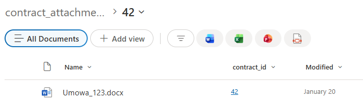

# SharePoint Setup – Contract Register Module

This document describes the required SharePoint configuration for the application.  
The structure consists of:

- **Main list**: `Contract_register` (contract register)
- **Document library**: `contract_attachments` (contract-related files)

---

## 1. List: `Contract_register`

This list is the central register of all contracts in the system.  
Each item represents a single contract together with its metadata.

### List Columns

| Column Name            | Column Type            | Required |
| ---------------------- | ---------------------- | -------- |
| Title                  | Single line of text    | No       |
| contract_title         | Multiple lines of text | No       |
| contract_type          | Choice                 | No       |
| status                 | Choice                 | No       |
| signer                 | Single line of text    | No       |
| Contractor_full_name   | Single line of text    | No       |
| Tax_no                 | Single line of text    | No       |
| registration_no        | Single line of text    | No       |
| Date_of_concluding_agr | Date and Time          | No       |
| Currency               | Single line of text    | No       |
| Amount                 | Number                 | No       |
| Description            | Multiple lines of text | No       |
| Start_date             | Date and Time          | No       |
| End_date               | Date and Time          | No       |
| Team                   | Single line of text    | No       |
| contact_person         | Person or Group        | No       |
| Procurement_type       | Single line of text    | No       |
| Person_data_processing | Single line of text    | No       |
| ATC                    | Single line of text    | No       |
| Legal_review           | Single line of text    | No       |
| Realisation_status     | Single line of text    | No       |
| Folder_ID              | Single line of text    | No       |
| annex                  | Yes/No                 | No       |
| start_flow             | Yes/No                 | No       |
| Modified               | Date and Time          | System   |
| Created                | Date and Time          | System   |
| Created By             | Person or Group        | System   |
| Modified By            | Person or Group        | System   |

---

### Choice Column Values

Some columns in the `Contract_register` list use predefined **Choice** values.

#### `contract_type` (Choice)

Available options:

- Electronic signature  
- Handwritten signature  

---

#### `status` (Choice)

Available options:

- New  
- Rejected  
- Submitted  
- In electronic signing  
- In handwritten signing  
- Contract signed and registered  
- Legal department approval  
- Rejected by Management Board  
- Management Board approval  
- Requires correction  
- Security department approval  
- Logistics department approval  

---

## 2. Document Library: `contract_attachments`

This document library is used to store all files related to contracts, including:

- signed contract documents
- annexes
- ATC requests
- additional supporting attachments

### Folder-based storage (Power Apps integration)

Each contract has its own dedicated folder inside the library.  
The folder is automatically created from the Power Apps application when a new contract record is generated.

- The folder name is based on a unique **Folder ID**
- The folder structure ensures that attachments remain grouped per contract
- Users do not manually create folders, everything is handled directly by the application

This approach provides clear document separation and makes contract navigation easier.

### Metadata linking (Lookup field)

In addition to folders, every document is also connected to its parent contract item using a lookup column:

- `contract_id` (Lookup → references `Contract_register`)

This guarantees that documents can always be filtered, displayed, and managed in the context of the correct contract inside the app.

---

### Library Columns

| Column Name    | Column Type            | Required |
| -------------- | ---------------------- | -------- |
| Title          | Single line of text    | No       |
| Description    | Multiple lines of text | No       |
| contract_id    | Lookup                 | No       |
| Created        | Date and Time          | System   |
| Modified       | Date and Time          | System   |
| Created By     | Person or Group        | System   |
| Modified By    | Person or Group        | System   |
| Checked Out To | Person or Group        | System   |

---

## 3. Relationship Between Contracts and Attachments

The connection between contracts and stored documents works on two levels:

1. **Folder structure**
   - Each contract gets its own folder automatically generated by Power Apps
   - All related attachments are saved inside that folder

2. **Lookup relationship**
   - Each file contains the `contract_id` lookup column
   - This links the document directly to the correct contract item in `Contract_register`

This combination ensures proper organization both visually (folders) and logically (metadata).

---

## 4. Permissions (temporary setup)

For the initial version of the solution, full access is granted to both:

- the `Contract_register` list
- the `contract_attachments` document library

This simplifies development and testing during the first implementation phase.

A dedicated permissions model (with restricted roles and controlled access) will be introduced later.

